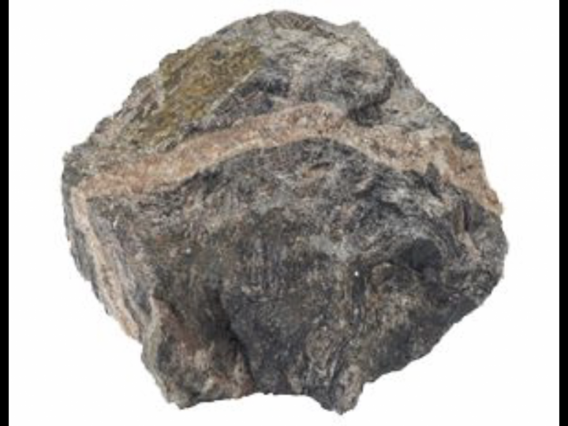

# Hello_Cavanes
Repository for people that Alejo bothers (ex: Tomás Ezequiel Cavanes)

Ahora cavanes es una banana, por eso cabanana en vez de cavanes. :banana::banana::banana::banana::banana::banana::banana::banana::banana::banana::banana::banana::banana::banana::banana::banana::banana::banana::banana:

Editado por alejan sandroni.
Lo que quiere decir mi compañero Alejandroni, es que banana es un elogio para las personas.
:trollface: :zap: :squirrel:
https://github.com/fegerva2/tp1

---
title: Dureza de los elementos
author: Tomás Cavanes
date: 15 de Abril de 2019
---

# Sección 1

## Subsección 1.1
*Alejo* es la piedra más dura del planeta

## Subsección 1.2
Según estudios realizados por profesionales, la dureza de Alejo es mayor que la de un diamante

# Sección 2

## Subsección 2.1
Todos quedaron atónitos ante la gran dureza de este ser huamno, apodado **Alejan "La Roca" Sandrini**

Una oración que requiere una cita.[^1]

[^1]: Aquí podrán observar imágenes de [Alejo](https://www.google.com.ar/search?q=piedra&rlz=1C1GIGM_enAR737AR737&source=lnms&tbm=isch&sa=X&ved=0ahUKEwj4wJ2RtdLhAhWtuVkKHdW0ALUQ_AUIDigB&biw=1600&bih=789).

